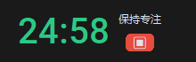

# 🍅 Focus Pomodoro (专注番茄钟)


**Focus Pomodoro** 是一款专为 Windows 设计的现代化、沉浸式桌面番茄钟工具。
基于 `CustomTkinter` 开发，拥有极简的暗黑风格界面。它摒弃了繁琐的设置，支持直接输入时长，并独创“沉浸模式”悬浮窗，助你快速进入心流状态。

---

## ✨ 核心功能 (Features)

* **🚀 沉浸模式 (Mini Mode)**
    * 点击开始后，主界面自动隐藏。
    * 右上角生成无边框的极简悬浮窗，仅显示倒计时。
    * 悬浮窗默认**置顶 (Always on Top)**，工作时抬头可见，不遮挡主要视野。

* **⚡ 灵活设定时长**
    * 告别固定的 25 分钟限制。
    * **直接输入**任意分钟数（如 45、60、90），回车即刻开始。

* **🎨 现代化 UI 设计**
    * 基于 CustomTkinter 的扁平化设计。
    * 原生支持**暗黑模式 (Dark Mode)**，护眼且美观。

* **🔔 智能提醒**
    * 倒计时结束自动播放系统提示音（Beep）。
    * 专注期间锁定输入框，防止误触修改时间。

---

## 📥 下载与安装 (Download)

### 方式一：直接下载安装包 (推荐用户)
前往本仓库的 [👉 Releases 页面](https://github.com/WUHUHANGKONG/FocusPomodoro-/releases) 下载最新的 `Setup.exe` 安装包。
* 安装后即可在桌面和开始菜单找到图标。
* 支持标准 Windows 卸载。

### 方式二：源码运行 (推荐开发者)
如果你安装了 Python 环境，可以直接运行源码：

1.  **克隆仓库**
    ```bash
    git clone [https://github.com/WUHUHANGKONG/FocusPomodoro-.git](https://github.com/WUHUHANGKONG/FocusPomodoro-.git)
    cd FocusPomodoro-
    ```

2.  **安装依赖库**
    ```bash
    pip install customtkinter pyinstaller
    ```

3.  **运行程序**
    ```bash
    python pomodoro.py
    ```

---

## 📸 界面预览 (Screenshots)

| 主界面 (设置时间) | 沉浸模式 (悬浮窗) |
| :---: | :---: |
|  |  |

---

## 🛠️ 技术栈 (Tech Stack)

* **核心语言**: Python 3
* **GUI 框架**: [CustomTkinter](https://github.com/TomSchimansky/CustomTkinter) (现代化 Tkinter 封装)
* **多线程**: `threading` (实现非阻塞倒计时)
* **打包工具**: PyInstaller (生成 .exe)
* **安装包制作**: Inno Setup Compiler

---

## 📂 项目结构

```text
FocusPomodoro/
├── pomodoro.py        # 主程序代码
├── icon.ico           # 应用程序图标
├── README.md          # 项目说明文档
├── .gitignore         # Git 忽略配置
└── dist/              # (打包生成的 exe 目录)
